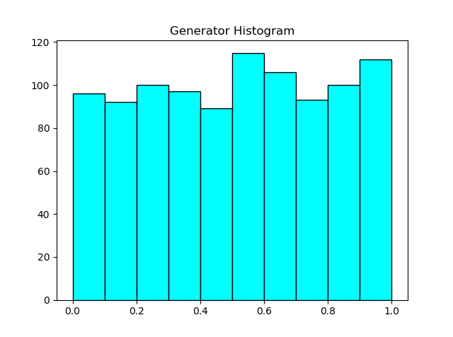

# Генератор случайных чисел
Исследование генератора псевдослучайных чисел, построенного линейным конгруэнтным методом.

## Результаты
Enter x0: 15023  
Enter q: 3567  
Enter n: 15  
  
E = 0.512142  
D = 0.0835786  
sigma = 0.2891  
x^2 = 6.64      

